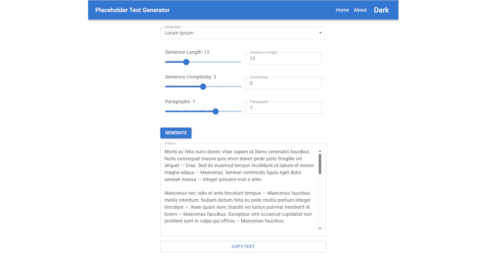

# Placeholder Text Generator

A fast, fully client‑side web app that generates realistic placeholder text in multiple styles (Academese, Corporate Speak, Fedspeak, Gibberish, Lorem Ipsum, Officialese, Pseudoscience, Psychobabble, Shakespeare, Technobabble).

Built with React + TypeScript + Vite and Material UI. No servers, no external APIs — everything runs in the browser.

<p align="center">
  
</p>

---

## Features
- Multiple “languages”/styles of placeholder text
- Adjustable parameters: sentence length, complexity, and number of paragraphs
- Copy‑to‑clipboard
- Light/Dark mode (follows system preference; toggle in the UI)
- Preferences persisted locally via `localStorage`
- SPA routing with 404 fallback for GitHub Pages

For detailed scope and requirements, see `.docs/PRD.md`.

---

## Tech Stack
- React 19 + TypeScript
- Vite 7
- Material UI 7
- Vitest + React Testing Library (for unit/UI testing)

---

## Getting Started (Local Development)

Prerequisites:
- Node.js 18+ recommended
- pnpm (preferred) or npm

Install dependencies:
```bash
pnpm install
# or
npm install
```

Run the dev server:
```bash
pnpm dev
# or
npm run dev
```

Build for production:
```bash
pnpm build
# or
npm run build
```

Preview the production build locally:
```bash
pnpm preview
# or
npm run preview
```

---

## Scripts
- `pnpm dev` — start Vite dev server
- `pnpm build` — type‑check and build
- `pnpm preview` — serve the production build locally
- `pnpm lint` — run ESLint

---

## Deployment
This project is set up for GitHub Pages deployment.

- The Vite base path is configured in `vite.config.ts`:
  ```ts
  base: mode === 'production' ? '/lorum.ipsum/' : '/'
  ```
- A `404.html` is included for SPA routing on GitHub Pages.
- A workflow (see `.github/workflows/deploy-pages.yml`) can build and publish on push to `main`.

Forking or renaming the repo?
- Update the `base` in `vite.config.ts` to match your repo name, e.g. `'/your-repo/'`.
- Or set a custom domain and use `'/'` as the production base.

---

## Project Structure
- `src/` — application source
  - `components/` — shared UI components (e.g., `AppLayout.tsx` with MUI layout and theme toggle)
- `public/` — static assets copied as‑is
- `index.html` — app entry HTML
- `404.html` — GitHub Pages SPA fallback
- `.docs/PRD.md` — product requirements

---

## Accessibility & UX
- Uses MUI components for baseline accessibility
- Color scheme toggle with clear labels
- Keyboard‑navigable controls

---

## Roadmap (high‑level)
- Implement Markov‑chain text generation engine per `.docs/PRD.md`
- Add corpora for each style and tune generation parameters
- Provide copy buttons and parameter presets per style
- Add unit tests for generators and UI controls

---

## Contributing
Issues and PRs are welcome. Please keep changes small and focused. Before submitting:
- `pnpm lint` and fix warnings where possible
- Add or update tests when changing core logic

---

## License
MIT (unless otherwise specified).
